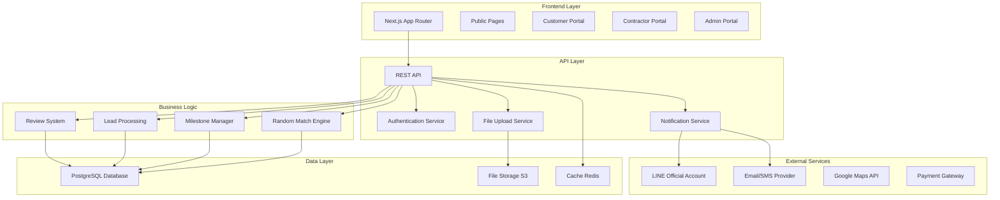
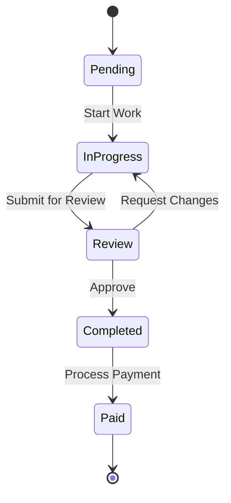
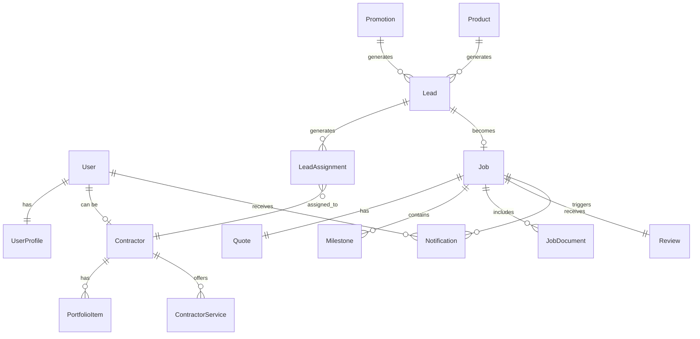

# Requirements Document

## Introduction

This document outlines the requirements for SPIDER, a contractor marketplace website that connects customers with verified contractors for various services including construction, renovation, interior design, repairs, and smart home installations. The platform features a unique Random Match system, milestone-based payments, and comprehensive dashboards for all user types.

## Requirements

### Requirement 1

**User Story:** As a visitor, I want to browse services and contractors without creating an account, so that I can evaluate the platform before committing.

#### Acceptance Criteria

1. WHEN a visitor accesses the homepage THEN the system SHALL display service categories, promotional highlights, and a search function
2. WHEN a visitor browses the contractor catalog THEN the system SHALL show contractor profiles with ratings, portfolios, and contact options without requiring authentication
3. WHEN a visitor views service pages THEN the system SHALL display service details with clear CTAs for booking site surveys
4. WHEN a visitor accesses smart home product pages THEN the system SHALL show product details with lead form options

### Requirement 2

**User Story:** As a customer, I want to submit service requests and get matched with qualified contractors, so that I can find reliable professionals for my projects.

#### Acceptance Criteria

1. WHEN a customer submits a lead form THEN the system SHALL validate required fields, create a lead ID, and send confirmation via email/SMS/LINE
2. WHEN a customer requests Random Match THEN the system SHALL provide 1-3 contractor options based on service type, location, budget, and availability
3. WHEN contractors respond to matches THEN the system SHALL notify the customer and allow them to proceed with their preferred choice
4. WHEN a customer selects a contractor THEN the system SHALL initiate the quotation and milestone planning process

### Requirement 3

**User Story:** As a customer, I want to track my project progress and manage payments through milestones, so that I have visibility and control over the work being done.

#### Acceptance Criteria

1. WHEN a quote is approved THEN the system SHALL create a milestone plan with due dates and payment schedules
2. WHEN milestone status changes THEN the system SHALL send notifications via email and LINE OA
3. WHEN a customer accesses their dashboard THEN the system SHALL display job pipeline, milestone status, documents, messages, and invoices
4. WHEN work is completed THEN the system SHALL prompt the customer to leave a review and rating

### Requirement 4

**User Story:** As a contractor, I want to manage my profile and receive relevant job opportunities, so that I can grow my business efficiently.

#### Acceptance Criteria

1. WHEN a contractor signs up THEN the system SHALL collect profile information including services, experience, portfolio, and service areas
2. WHEN a contractor profile is submitted THEN the system SHALL require admin approval before publishing
3. WHEN job opportunities arise THEN the system SHALL notify contractors based on their service types and availability
4. WHEN a contractor receives a job match THEN the system SHALL allow accept/decline with reason within a specified timeframe

### Requirement 5

**User Story:** As a contractor, I want to track my earnings and schedule through a dashboard, so that I can manage my business effectively.

#### Acceptance Criteria

1. WHEN a contractor accesses their dashboard THEN the system SHALL display work schedule, earnings by month, and notifications
2. WHEN a contractor updates work progress THEN the system SHALL reflect changes in customer tracking and milestone status
3. WHEN a contractor manages their portfolio THEN the system SHALL allow uploads, edits, and organization of work samples
4. WHEN a contractor toggles job sources THEN the system SHALL respect their preference for catalog vs system-assigned jobs

### Requirement 6

**User Story:** As a coordinator, I want to manage the Random Match process and job assignments, so that I can ensure efficient contractor-customer matching.

#### Acceptance Criteria

1. WHEN leads are submitted THEN the system SHALL display them in the coordinator queue for processing
2. WHEN running Random Match THEN the system SHALL generate ranked contractor lists that coordinators can review and override
3. WHEN contractors decline jobs THEN the system SHALL trigger reassignment or broadcast to the contractor pool
4. WHEN job statuses change THEN the system SHALL log all actions with timestamps and user attribution

### Requirement 7

**User Story:** As a sales representative, I want to manage quotes and milestone tracking, so that I can oversee the commercial aspects of projects.

#### Acceptance Criteria

1. WHEN creating quotes THEN the system SHALL allow upload/creation with milestone breakdowns and due dates
2. WHEN quotes are approved THEN the system SHALL automatically create milestone tracking for customers
3. WHEN updating job milestones THEN the system SHALL trigger appropriate notifications to customers
4. WHEN accessing sales dashboard THEN the system SHALL display lead pipeline, revenue tracking, and job statuses

### Requirement 8

**User Story:** As an admin, I want full system control including user management and contractor approval, so that I can maintain platform quality and security.

#### Acceptance Criteria

1. WHEN new contractors register THEN the system SHALL require admin review and approval before profile activation
2. WHEN managing users THEN the system SHALL allow role assignment, permission management, and account status changes
3. WHEN accessing admin dashboard THEN the system SHALL provide comprehensive system oversight including moderation queues
4. WHEN managing content THEN the system SHALL allow updates to promotions, news, products, and static pages

### Requirement 9

**User Story:** As any user, I want the website to be fast, accessible, and available in multiple languages, so that I can use it effectively regardless of my needs or abilities.

#### Acceptance Criteria

1. WHEN accessing any page THEN the system SHALL meet Core Web Vitals targets (LCP ≤ 2.5s, CLS ≤ 0.1, TBT ≤ 200ms)
2. WHEN using assistive technologies THEN the system SHALL comply with WCAG 2.2 AA standards
3. WHEN switching languages THEN the system SHALL provide Thai/English toggle with appropriate content localization
4. WHEN using mobile devices THEN the system SHALL provide responsive design with mobile-first approach

### Requirement 10

**User Story:** As a system administrator, I want robust security and audit capabilities, so that I can ensure data protection and compliance.

#### Acceptance Criteria

1. WHEN users access system functions THEN the system SHALL enforce role-based access control
2. WHEN sensitive data is stored THEN the system SHALL encrypt PII at rest and in transit
3. WHEN job state changes occur THEN the system SHALL create audit logs with user attribution and timestamps
4. WHEN forms are submitted THEN the system SHALL implement rate limiting, CAPTCHA, and CSRF protection

### Requirement 11

**User Story:** As a user, I want to receive timely notifications about important events, so that I stay informed about my projects and opportunities.

#### Acceptance Criteria

1. WHEN key events occur THEN the system SHALL send notifications via email and LINE Official Account
2. WHEN contractors are matched THEN the system SHALL notify all relevant parties with appropriate details
3. WHEN milestones are updated THEN the system SHALL send status notifications to customers
4. WHEN jobs are broadcast THEN the system SHALL notify eligible contractors in the pool

### Requirement 12

**User Story:** As a customer, I want to search and filter contractors effectively, so that I can find the best match for my specific needs.

#### Acceptance Criteria

1. WHEN searching contractors THEN the system SHALL provide filters by service type, location, budget range, and ratings
2. WHEN viewing contractor profiles THEN the system SHALL display success rates, portfolio samples, and customer reviews
3. WHEN comparing contractors THEN the system SHALL show trust signals including ratings, experience, and verification status
4. WHEN contacting contractors THEN the system SHALL provide integrated lead forms and messaging capabilities

# Design Document

## Overview

SPIDER is a contractor marketplace platform built with modern web technologies to provide a seamless experience for customers, contractors, and back-office staff. The system implements a unique Random Match algorithm, milestone-based project management, and comprehensive dashboards for all user types.

The platform follows a microservices-inspired architecture with clear separation between public-facing content, user portals, and administrative functions, while maintaining a unified user experience.

## Architecture

### High-Level Architecture



### Technology Stack

**Frontend:**
- Next.js 14+ with App Router for SSR/ISR and optimal SEO
- TypeScript for type safety and developer experience
- Tailwind CSS for responsive, utility-first styling
- React Hook Form for form management and validation
- Zustand for client-side state management
- React Query for server state management and caching

**Backend:**
- Node.js with NestJS framework for scalable API architecture
- Prisma ORM for type-safe database operations
- PostgreSQL for primary data storage
- Redis for caching and session management
- Bull Queue for background job processing

**Infrastructure:**
- Vercel for frontend hosting with edge functions
- AWS S3 for file storage and CDN
- Railway/Render for backend hosting
- GitHub Actions for CI/CD pipeline

## Components and Interfaces

### Core Components

#### 1. Authentication & Authorization System

**JWT-based Authentication:**
- Access tokens (15 minutes) and refresh tokens (7 days)
- Role-based access control (RBAC) with granular permissions
- Magic link authentication for contractors
- 2FA for admin and back-office users

**User Roles & Permissions:**
```typescript
enum UserRole {
  VISITOR = 'visitor',
  CUSTOMER = 'customer', 
  CONTRACTOR = 'contractor',
  COORDINATOR = 'coordinator',
  SALES = 'sales',
  ADMIN = 'admin'
}

interface Permission {
  resource: string;
  actions: ('create' | 'read' | 'update' | 'delete')[];
}
```

#### 2. Random Match Engine

**Matching Algorithm:**
- Service type compatibility scoring
- Geographic proximity calculation (radius-based)
- Contractor availability checking
- Rating and success rate weighting
- Budget range alignment
- Workload balancing

**Implementation:**
```typescript
interface MatchCriteria {
  serviceType: string;
  location: GeoPoint;
  budget: BudgetRange;
  urgency: 'low' | 'medium' | 'high';
  customerPreferences?: ContractorPreferences;
}

interface MatchResult {
  contractors: ContractorMatch[];
  confidence: number;
  reasoning: string[];
}
```

#### 3. Milestone Management System

**Milestone Workflow:**
- Quote approval triggers milestone creation
- Automatic status progression with manual overrides
- Payment integration with milestone completion
- Customer and contractor notifications

**Status Flow:**


#### 4. Notification System

**Multi-channel Notifications:**
- Email notifications for formal communications
- LINE OA for real-time updates (Thai market preference)
- In-app notifications for immediate actions
- SMS for critical alerts

**Notification Types:**
- Lead submissions and assignments
- Match results and contractor responses
- Milestone updates and payment confirmations
- Review requests and system alerts

### User Interface Components

#### 1. Public Website Components

**Homepage:**
- Hero section with service search
- Featured service categories grid
- Contractor spotlight carousel
- Promotional banners
- Trust indicators (reviews, completed projects)

**Service Pages:**
- Service category overview
- Contractor filtering and search
- Lead capture forms
- Success stories and testimonials

**Smart Home Product Pages:**
- Product catalog with filtering
- Detailed product specifications
- Installation service integration
- Lead generation forms

#### 2. Customer Portal Components

**Dashboard:**
- Active projects overview
- Milestone progress tracking
- Recent notifications
- Quick actions (new project, messages)

**Project Management:**
- Detailed project timeline
- Document management
- Contractor communication
- Payment history

#### 3. Contractor Portal Components

**Dashboard:**
- Earnings overview with monthly breakdown
- Work schedule calendar
- Job opportunity notifications
- Performance metrics

**Profile Management:**
- Service offerings configuration
- Portfolio management
- Availability settings
- Pricing and service area setup

#### 4. Admin Portal Components

**Moderation Queue:**
- Contractor approval workflow
- Content moderation tools
- Lead assignment interface
- System health monitoring

**Analytics Dashboard:**
- Platform usage metrics
- Revenue tracking
- User engagement analytics
- Performance monitoring

## Data Models

### Core Entities

```typescript
// User Management
interface User {
  id: string;
  email: string;
  phone: string;
  role: UserRole;
  profile: UserProfile;
  createdAt: Date;
  updatedAt: Date;
}

interface UserProfile {
  firstName: string;
  lastName: string;
  avatar?: string;
  language: 'th' | 'en';
  notifications: NotificationPreferences;
}

// Contractor System
interface Contractor {
  id: string;
  userId: string;
  businessName: string;
  services: ServiceType[];
  serviceAreas: Province[];
  experience: number;
  portfolio: PortfolioItem[];
  verification: VerificationStatus;
  ratings: ContractorRating;
  availability: AvailabilitySettings;
}

interface ContractorRating {
  average: number;
  totalReviews: number;
  successRate: number;
  responseTime: number;
}

// Lead and Job Management
interface Lead {
  id: string;
  customerId: string;
  serviceType: ServiceType;
  description: string;
  location: Location;
  budget: BudgetRange;
  urgency: UrgencyLevel;
  status: LeadStatus;
  assignedContractors: string[];
  createdAt: Date;
}

interface Job {
  id: string;
  leadId: string;
  contractorId: string;
  customerId: string;
  quote: Quote;
  milestones: Milestone[];
  status: JobStatus;
  documents: Document[];
}

interface Milestone {
  id: string;
  jobId: string;
  title: string;
  description: string;
  amount: number;
  dueDate: Date;
  status: MilestoneStatus;
  completedAt?: Date;
}

// Content Management
interface Promotion {
  id: string;
  title: string;
  description: string;
  image: string;
  validFrom: Date;
  validTo: Date;
  serviceTypes: ServiceType[];
  isActive: boolean;
}

interface Product {
  id: string;
  category: 'solar' | 'ev-charger' | 'smart-device';
  name: string;
  description: string;
  specifications: Record<string, any>;
  images: string[];
  priceRange: BudgetRange;
}
```

### Database Schema Relationships



## Error Handling

### Error Categories and Responses

**Validation Errors (400):**
- Form validation failures
- Business rule violations
- Invalid request parameters

**Authentication Errors (401/403):**
- Invalid or expired tokens
- Insufficient permissions
- Account verification required

**Business Logic Errors (422):**
- Contractor unavailable for matching
- Milestone progression violations
- Payment processing failures

**System Errors (500):**
- Database connection failures
- External service timeouts
- Unexpected application errors

### Error Response Format

```typescript
interface ErrorResponse {
  error: {
    code: string;
    message: string;
    details?: Record<string, any>;
    timestamp: string;
    requestId: string;
  };
}
```

### Retry and Fallback Strategies

**Critical Operations:**
- Payment processing: 3 retries with exponential backoff
- Notification delivery: Queue-based retry with dead letter handling
- External API calls: Circuit breaker pattern with fallback responses

**User Experience:**
- Graceful degradation for non-critical features
- Offline capability for viewing cached data
- Clear error messages with suggested actions

## Testing Strategy

### Testing Pyramid

**Unit Tests (70%):**
- Business logic functions
- Utility functions and helpers
- Component logic and hooks
- API endpoint handlers

**Integration Tests (20%):**
- Database operations
- External service integrations
- API endpoint workflows
- Authentication flows

**End-to-End Tests (10%):**
- Critical user journeys
- Cross-browser compatibility
- Mobile responsiveness
- Performance benchmarks

### Test Scenarios

**Random Match Engine:**
- Contractor availability verification
- Geographic proximity calculations
- Rating and preference weighting
- Edge cases (no available contractors)

**Milestone Management:**
- Status progression workflows
- Payment integration flows
- Notification triggering
- Concurrent update handling

**User Authentication:**
- Role-based access control
- Token refresh mechanisms
- Magic link authentication
- 2FA implementation

### Performance Testing

**Load Testing:**
- Concurrent user scenarios
- Database query optimization
- API response time benchmarks
- File upload performance

**Accessibility Testing:**
- Screen reader compatibility
- Keyboard navigation
- Color contrast validation
- Focus management

### Security Testing

**Penetration Testing:**
- SQL injection prevention
- XSS attack mitigation
- CSRF protection validation
- File upload security

**Data Protection:**
- PII encryption verification
- Secure data transmission
- Access control validation
- Audit log integrity

## Deployment and Monitoring

### Deployment Strategy

**Environment Setup:**
- Development: Local with Docker Compose
- Staging: Production-like environment for UAT
- Production: Multi-region deployment with CDN

**CI/CD Pipeline:**
- Automated testing on pull requests
- Security scanning and dependency checks
- Automated deployment to staging
- Manual approval for production deployment

### Monitoring and Observability

**Application Monitoring:**
- Error tracking with Sentry
- Performance monitoring with Web Vitals
- User analytics with privacy-compliant tools
- Business metrics dashboard

**Infrastructure Monitoring:**
- Server health and resource usage
- Database performance metrics
- API response times and error rates
- External service availability

**Alerting:**
- Critical error notifications
- Performance degradation alerts
- Security incident notifications
- Business metric anomalies